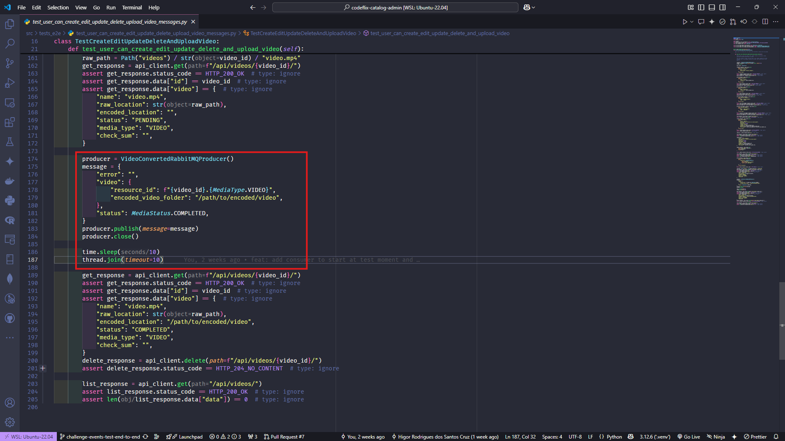

# codeflix-catalog-admin

Administração de Catálogo – Codeflix - Python

## Running

```bash
python3 -m venv .venv
source .venv/bin/activate
pip install -r requirements.txt
python manage.py migrate
docker run -d --hostname rabbitmq --name rabbitmq -p 5672:5672 -p 15672:15672 rabbitmq:3-management
python manage.py startconsumer
python manage.py runserver
```

## Teste

```bash
python3 -m venv .venv
source .venv/bin/activate
pip install -r requirements.txt
python manage.py migrate
docker run -d --hostname rabbitmq --name rabbitmq -p 5672:5672 -p 15672:15672 rabbitmq:3-management
python manage.py runserver
```

## ATENÇÃO: Não iniciar o consumer pelo comando do Django (python manage.py starconsumer)

O Consumer sendo inciado fora do teste implica no uso do banco de dados de "produção" ao invés do banco de dados criado temporariamente para o teste. Ao publicar a mensagem de novo vídeo no RabbitMQ, o Consumer tentará encontrar as informações do vídeo no banco de dados de "produção" e retornará o erro de vídeo não encontrado.

### Chamada do Consumer


### Producer enviando a mensagem de novo vídeo convertido



### Resultado do teste


